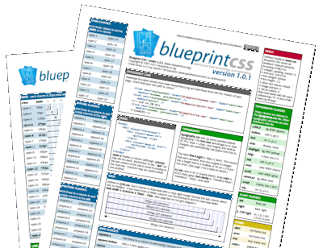

# Blueprint CSS cheat sheet

**Spend your time coding, not trying to remember class names**

* Project: Blueprint cheat sheets
* Version: 4.4.0
* Author: Gareth J M Saunders
* Description: Cheat sheet for use with Blueprint CSS v.1.0.1 and lower.
* Last updated: Sunday 18 March 2012

**This is a cheat sheet for the original Blueprint CSS framework (not v3.x which uses CSS Grid and Flexbox) and is provided for reference and archive purposes.**

---

The Blueprint cheat sheet is a handy guide to all the classes used in [Blueprint CSS](https://github.com/joshuaclayton/blueprint-css). It is available for the following versions of Blueprint CSS:

* Blueprint CSS v1.0.1
* Blueprint CSS v0.9.1
* Blueprint CSS v0.8
* Blueprint CSS v0.7.2

Source version is available in PDF and Microsoft Office Publisher formats.

---

## Features

### Grid
Every class used in the grid, including:

* .span-x
* .prepend-x
* .append-x
* .push and .pull

### Typography
* Basic introduction to the font-size, font-stack and line-height.
* Includes every typography class defined including images.

### Forms
Overview of form elements and classes including alert, error, info, notice and success.

### IE fixes
Overview of the fixes required for Blueprint CSS to work successfully in Internet Explorer versions 5, 6, 7 and 8.

### Full grid, line-height and more
The latest cheat sheet (for Blueprint CSS v.1.0) now features a second page showing the full grid, a line-height ready-reckoner and various links to tools and resources.

---

## About Blueprint CSS

Blueprint is a CSS framework, which aims to cut down on your development time.

It gives you a solid foundation to build your project on top of, with an easy-to-use grid, sensible typography, useful plugins, and even a stylesheet for printing.

---

## License

This work is licenced under a GNU general public license version 3. In short, if you make a derivative work using this as your source and distribute it to others then you must do likewise.